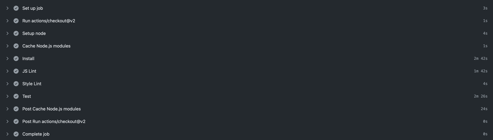
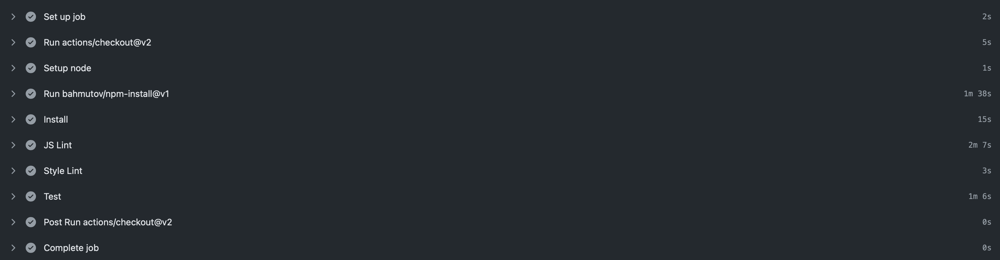
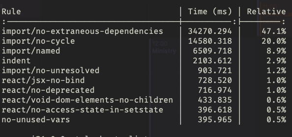

A seldom thought of component of performance is that of continuous integration performance. Here at [York Press](https://york-e.com), we are big users of both Azure Pipelines and GitHub Actions. Due to us hosting our Azure pipeline runners, "job minute" restrictions were never a concern from a billing perspective. Although, the long running jobs did frustrate the team. Having moved some key processes over to GitHub Actions, I decided it was time that we looked at improving the performance of one of our core repositories. Not only would this mean developers had quicker feedback, but it would also mean we burned through our actions minutes a lot slower. Here's how I did it.

## Initial Investigation

GitHub actions (and I promise this isn't an ad) has a handy feature whereby you can see how many seconds each stage of the job took.

<div class="image">
	
</div>

The first thing I spotted was how long installing npm modules took - nearly 3 minutes! Because of this, I chose to combine the Test and Lint pipeline so that we would not need to duplicate the module installation.

Secondly, I swapped out my normal `npm ci` command for another action `bahmutov/npm-install@v1`. This action handles all the cache invalidation and storage of node modules across builds so you can save time with installing them. After those changes, here is what the timings looked like...

<div class="image">
	
</div>

Half the time gone! That's a good start but still not far enough. I found the modules were taking ages to install due to a Webpack plugin responsible for optimizing images, something we didn't need in the CI process. I moved this out into an `optionalDependencies` and then set the command to `npm ci --no-optional`

## ESLint

The other big fish to fry was ESLint, it took nearly 2:30 minutes to run. I tried to debug this locally using an environment variable `TIMING=1`. This gives you a table view of how long each ESLint rule took to check.

<div class="image">
	
</div>

Interestingly, it was the `import/` rules that were taking the longest. After some google-fu, [I discovered that it was due to having to build a dependency graph](https://github.com/benmosher/eslint-plugin-import/issues/1793) across the codebase. Our codebase is fairly large so it was understandable why it would take this long. I didn't want to remove the rule entirely as it was useful, but surely there was a way around it...

Actions to the rescue! Fortunately, a kind internet person has created a github action that will run ESLint only on the files that have changed. I swapped this out like so

```yaml
- uses: tinovyatkin/action-eslint@v1
  with:
    repo-token: ${{secrets.GH_TOKEN}}
    check-name: eslint
```

This completely eliminated that time taken if no files had been changed matching the scanning glob.

From there, I spent more time than I care to admit trying to trim the time down. The main blockers were the dependency install (1:20s average) and the Jest test suite (50s average). Although there are ways to [run the Jest suite in parallel](https://imhoff.blog/posts/parallelizing-jest-with-github-actions) it sort of seems redundant at this stage. The install is the big job, but the unfortunate battle is that we have Webpack image-loader as a `devDependency`. This then installs a whole host of binary packages that then get built from source - every. single. time. Anywho, I'm pleased with reducing it by 76%.

Here are my main takeaways:
1) Spend time speeding up your CI - fast developer feedback is important and saves you money (if you're restricted on pipeline minutes)
2) Use the pre-built actions - there is a huge marketplace of actions that solve a bunch of problems and have smart defaults. GitHub Actions is great (and I promise this isn't an ad), in part, because it's like code lego.

I hope this helps you with your journey in speeding up your CI.
