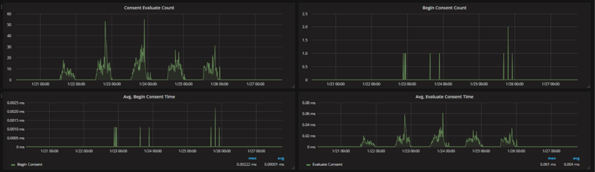

<div class="image">
	
	<em>This guide assumes you already have a basic NodeJS API and a Graphite instance configured.</em>
</div>

Graphs are a great way to monitor your services, and as an added bonus — they look cool.

I always looked at companies with giant flat screen monitors with pages of various graphs and thought that was all way over my head. Turns out, it’s surprisingly easy.

At CloudCall, we are heavy users of Grafana and a data source behind it called StatsD. We use it to monitor throughput on services as well as general tracking of if a certain service is being used. Here is a guide on getting your shiny API monitored using Graphite.

First thing you need is a Grafana instance. It’s easy to get setup with Grafana — the [installation docs](http://docs.grafana.org/installation/) are all you will need. You could spin this up locally or run it on a VPS or similar.

After you have picked the route you want to start work on you can run
> npm i -s node-statsd-client

This is the statsd client we will be using. StatsD runs on a UDP port and this library simply pushes a string of data via UDP. There are a number of other statsd libraries out there, but I have found this one to be the most reliable — your mileage may vary.

Next up is to create some kind of wrapper around the statsD client as I found it difficult to use (and also not typescript ready).

```ts
import { Client } from "node-statsd-client";
import { IGraphiteController } from "../interfaces";

const PREFIX = "MY-API-NAME";

export default class GraphiteController implements IGraphiteController {
    private _client: any;
    // the graphite port will always be this for every environment
    private _port: number = 8125;
    private static _instance: GraphiteController;

    // Check if we are running tests, if so, deactive the graphite logging
    private testing: boolean = process.env.NODE_ENV === "testing";

    constructor(config: any) {

        if (!this.testing) {

            try {
                this._client = new Client(config.statsd, this._port);
            } catch (err) {
                throw new Error(`There was an error connecting to Graphite: ${err}`);
            }

        }

    }

    public static getInstance(config: any): GraphiteController {
        if (!this._instance) {
            this._instance = new GraphiteController(config);
        }
        return this._instance;
    }

    public write(activityType: string, error: boolean = false): void {
        if (!this.testing) {
            this._client.increment(`${PREFIX}.${activityType}${error ? ".error" : ""}`);
        }
    }

    /**
     * Writes a graphite timing
     * This is used to measure the time a function or piece of logic takes
     * @param  {string} activityType
     * @param  {Date} startDate - a new Date() object. Create this as a variable at the top of the function and then pass it in
     * @returns void
     */
    public writeTiming(activityType: string, startDate: Date): void {
        if (!this.testing) {
            this._client.timing(`${PREFIX}.${activityType}`, (new Date().getTime() - startDate.getTime()));
        }
    }

}
```

Most importantly, we a static `*getInstance()*` method. But why? We found that, long lived services (anything not serverless) would create a massive amount of UDP connections over time and eventually make it so the service could not create any new connections. We use this getInstance method so we make sure we use a single connection throughout the app.

So how do we implement it?

First we need to import it into our route file
> import GraphiteController from “./graphite”;

Next, at the top of the file let’s get an instance of the graphite controller that we can reuse in this file. We create it with the configuration that contains the url for the statsd instance.
> const graphiteController = GraphiteController.getInstance(config);

Ok, now we’ve got an instance of the controller we can now record some data.

The first piece of data to record is a simple counter to see how many times a certain route has been used. This is useful because it might be that you need to pull out certain routes into new services so that they can be independently scaled. It may also be that a route was written but never used, so this can be factored out. Let’s add this counter — make sure to add it as the last thing in your router, right before you return the response. That way, if there are any errors along the way then we will not get a count that didn’t succeed.

Here is our router file now

```ts
import { Router } from "express";
import { Config } from "./configuration";

// Import or require the graphite controller and activity labels
import { GraphiteController, GraphiteLabel } from "../graphite";

const router = Router() as Router;

// Load your config
const config = Config.getConfig();

// Import the graphite controller
const graphiteController = GraphiteController.getInstance(config);

router.get("/", async (req, res, next) => {

   try {
       const record = await UserController.get(req.query, req.jwt.accountId);

       if (record) {
           // Just before the response is sent, we log the route being called
           graphiteController.write(“GetUsers”);
           res.json({ success: true, data: record });
       } else {
           res.status(404).send();
       }
   } catch (err) {
       next(new InternalServerError("There was an error getting data from the database"));
   }
});

export default router;
```

Ok, now we’ve setup a log counting the number of successful calls the route has, we should also track any unsuccessful calls to the router. This way, if you see a sudden spike in errors, you can see exactly where that error is occurring.

Add this to the catch block in the router. The second argument defaults to false but when true, signals that this call was an error. In the background, this will append .error to the UDP message, meaning you can filter those calls separately.
> graphiteController.write(“GetUsers”, true);

Next we will add time tracking to the route. This way we can see how long a certain route took to execute. This is a great piece of information to have as you can see if you perhaps need to upgrade the machine your API is running on, or where to focus optimization efforts.

To do this you need to record the start time that the route was called. You can do this simply by
> const startTime = new Date();

Next, underneath the .write method you added earlier you can add a new call to the write timings method.
> graphiteController.writeTiming(“GetUsers”, startTime);

Here we have passed “GetUsers” as the activity or label for graphite and the start time of the route call. In the background, the wrapper calculates the time between the start time and the current time.

And hey presto. You will now be pushing the route timings to StatsD!

At this point, try calling your API endpoints a few times so we have some data to work with. Next, we can move onto to creating the graphs.

Let’s first create the “count” graph that tracks how many times and when the route was called.

Create a new dashboard and you should find yourself on a screen like this. I would recommend creating a new “dashboard” for each API/Service


Move your mouse over to the left and click “Add Panel” in the little menu that pops out. Then click “Graph”


Now, click the graph and click “Edit”. Now we can add a data source for our graph.

Set your data source as your Graphite DB so you can now perform queries for your data. You will need to build up a query like this:


Let’s break this down

* `*` — This is a wildcard query as we do not need to narrow it down just yet

* “MYPREFIX” — this our prefix that is configured in the GraphiteController at the top of the file

* “GetUsers” — the graphite activity or label, you should use a descriptive name depending on which route you are working on

* “Count” — this is the counter, there should also be one for “timer”

* “consolidateBy(sum)” — This rounds the values so that you get only integer values rather than decimals

* “alias(Get Users Count)” — the alias label for the query, this applies when you show the averages, min and max values.

You should now have a graph like this


For our “error” graph, simply repeat the steps and change the query to add an extra “error” metric — so the full query will be something like * * MYPREFIX GetUsers count error.

A similar process is taken for the timing graph, simply change the query from “count” to “rate” and this will be the timings for the route.

And there we go! Done and dusted! Now you’ve got it working for a single route, you can follow the steps again for all your other routes!

Did you find this guide useful? Would you like to see similar content in the future? Let me know on twitter [@joshghent](http://twitter.com/joshghent) or in the comments below.
