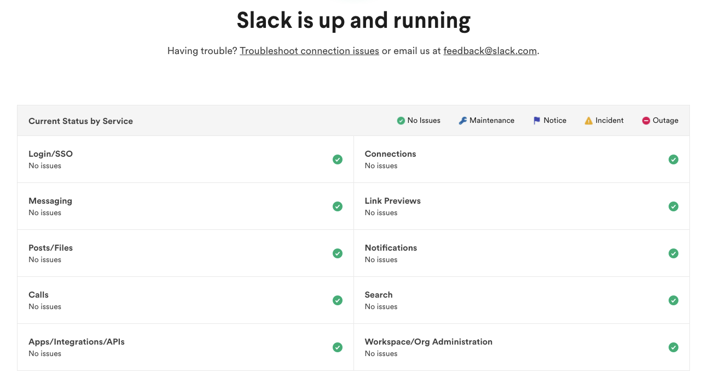

For many, having a health check in your application may be somewhat of an afterthought. Maybe your application does have a health check, but you've got no idea if it actually works. I didn't give it much of a thought until I truly understood that one of the key pillars of good development is monitoring. And to be able to monitor a service, you need to know if it's up, down or fallen down the stairs.

Application health checks can be useful not only for internal usage but also external and can aid with supporting customers. Take a look at many large companies and they all have public status pages (especially developer focused ones). Aren't they embarrassed whenever they go down? Perhaps, but it's a natural part of all systems, and the benefit to them is that customers can easily see that they are aware of the problem and are actively working to fix it. Otherwise, they'd be crowding support channels and generally getting frustrated.

## So health checks are important, but how can we create one?

If you have a health check in your application, chances are it might look something like this

```ts
import express from 'express';

const router = express.Router();

router.all('/health', (req, res) => {
  res.status(200);
});
```

Ok! Good start. In this basic example, this express API is telling the caller of the `/health` endpoint that it is up. That can be important information to know, but fairly redundant in some cases. For example, if you host your application using AWS Lambda, Azure Functions, or whatever the GCP one is, then, in reality, all this endpoint is doing is telling you that the cloud provider has not gone down - which is far less likely that your application being unhealthy.

## Define "unhealthy"

A good place to start is to define what unhealthy means for your service. In other words, at what stage will your core application become unusable to the point where your customers will react something like this.

<div class="image">
	
</div>

Nowadays, systems are never usually completely "down" but rather have failure points across a range of services. For example, if you run a microservice architected infrastructure then perhaps one piece of functionality will not work but the core of the application will. Your health checks and your messaging to customers needs to reflect this.

At Cappfinity, we depend on a number of services to run a pipeline for customers and their candidates alike. Our "unhealthy" state would be when our scoring provider is down, our API and Database are unreachable or when our authentication provider is down. If any of these three components go down then we would not be able to deliver a core service to our customers. Depending on your business, you may have more or less components that you critically depend on.

> As an aside, try to look into each one of these components to see if you can deliver a reduced experience if they are unavailable. Netflix do this to great success and you can read more about that here: [https://netflixtechblog.com/making-the-netflix-api-more-resilient-a8ec62159c2d](https://netflixtechblog.com/making-the-netflix-api-more-resilient-a8ec62159c2d)

## Improving the health check
Ok so we've defined what "unhealthy" is, so now we need to build the health check itself.

First, let's dive into each of our critical components and add an endpoint or monitoring around if they can connect to all of their dependant third parties.
For example, if our API depends on a Database and an authentication provider then we might have the following

```ts
import express from 'express';
import Database from './lib/database'
import Auth from './lib/auth';

const router = express.Router();

router.all('/health', async (req, res) => {
  const db = await Database.connect(); // check we can connect to the database
  const auth = await Auth.getUserById(1); // check if we can get a random user from our auth provider

  return res.json({
    db: db ? "healthy" : "unhealthy",
    auth: auth ? "healthy" : "unhealthy"
  });
});
```

Great, so now we're able to tell any caller of this endpoint that:

1) The API is up
2) The Database is up
3) The authentication provider is up
4) The API can connect to the database
5) The API can connect to the authentication provider

The last two points are key, because although you might be able to create a new service that goes and pings these services to see if they are up, you are not telling the caller if those services can be reached. Often, firewalls, static IP's, bad credentials, and other application issues can prevent a service from connecting to another. So it's important to test the connectivity from which ever service relies on it.

## Internal vs External

That health check endpoint is exactly what developers need to assist with debugging a service. However, saying that your database is down to a customer is not really relevant and may even confuse them. In all reality, if you are building a customer facing experience for your service status then you need to think about how to communicate what the impact for them is.

For example, take a look at Slack status page

<div class="image">
	
</div>

You can see that it doesn't contained detailed break downs of information, but rather individual components of a system that a customer will be familiar with - messaging, login, notifications etc. You should follow a similar pattern, if your system is an API that delivers Woody Harrelson's face as placeholder images for frontend developers, then perhaps you'd have the following services you can report on:
* The API
* Harrelson import system - for importing a continuous feed of Woody Harrelson's and cropping out everything but the face
* Harrelson's calculator service - the service for getting the correct Woody Harrelson picture based on the size requested by the caller

You can then report those data points to a frontend status page whilst keeping your in-depth health checks that are only accessible by your developers internally.

<div class="image">
	
  <em>There we go! Ready for production!</em>
</div>

## Resistance

In the past, I've seen some companies be hesitant about revealing in depth information about the health of their systems. If you face this kind of opposition then you can reason that the company will benefit for the following reasons:

1) The company is transparent about it's successes and shortcomings which appeals to people and businesses
2) The company is proud of great engineers debugging systems and fulfilling any contractual SLA's
3) Developers who consume your application don't have to ring your support line to get help if the system is down
4) You're following in the footsteps of some of the largest companies in the world - Netflix, Slack, Stripe, Apple etc.

## Overview

I hope you've learnt something and can go out and improve your systems health checks! Please feel free to share with me any of your tips for creating great health checks in the comments below. That's right! My pocky little blog has comments. It's right posh round 'ere now.
