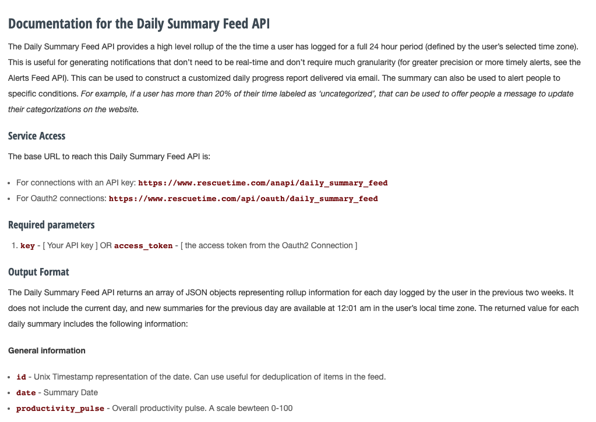
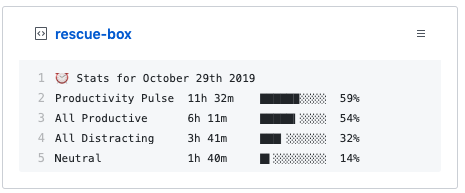

Recently I stumbled upon an awesome page I hadn't seen before [awesome pinned gists](https://github.com/matchai/awesome-pinned-gists). The premise of the list is small apps that run GitHub actions on a schedule to update a gist that is then pinned to your profile.
There are ones for monitoring your [Wakatime](https://github.com/matchai/waka-box), your [last tweet](https://github.com/matchai/bird-box) or even your [Strava Metrics](https://github.com/JohnPhamous/strava-box).

It inspired me to create my own using RescueTime data - called [rescue-box](https://github.com/joshghent/rescue-box) (if you notice, all the apps are appended with `-box`).

Here is how I created rescue-box and *how you can create your own Pinned Gist Bot!* This whole process took me around 10 minutes and is a fairly easy process.

## 1. Pick an Idea
The first and most important step is to have an idea for what data you want to display in your pinned gist. In my case, I chose RescueTime productivity data, but below are some other ideas if you're a bit stuck

* FitBit Step Count
* JIRA ticket last complete by yourself
* Todoist Tasks completed today
* Reddit upvotes for your user
* PocketCast listening time

## 2. Get the data
Now once you have chosen your idea you need to find where you can get the data for your app.
Most services have a public API, so try Googling `<APP NAME> API documentation`. In my case, I found the RescueTime documentation [here](https://www.rescuetime.com/apidoc)

Inside the documentation, you will be able to find the endpoint you need to call to get the data as well as information about how to authenticate the request.

<div class="image">
	
  <em>The RescueTime API Docs I used</em>
</div>

Once you have the request, mock it up in a tool such as Postman or Insomnia so you can see how the data will come back from the API.

This is the most tricky part of the process as your idea may not have a public API or the authorization may be too tricky to implement, in this case, try another idea until you find one - this is the most difficult part of the process.

## 3. Get the foundations
To bypass the boring setup, clone my rescue-box repo as this will give you a great starting point - especially if you are building something in the same format as I did
You can do this by running
```bash
$ git clone https://github.com/joshghent/rescue-box
```

Change all the references to rescue-box to your own app name and replacing the `RESCUETIME_API_KEY` references with your own service's name (e.g., `FITBIT_API_KEY`). More importantly, update the documentation on how to setup the application - include information and links on where to get the API key for the service you are integrating with.

Now run `npm install` in your terminal to install the dependencies

## 4. Modify the API call
Inside the `index.js` file in the `main()` function, change the API call URL to be the one for your service. Additionally, change the environment variables loaded at the top with the ones for your service.

Next, inside the `updateGist` function, change the code from `line 30` onwards to be what you want to inject into the pinned gist.

Rescue-box injects a line for each type of "productivity" metric and then has a bar next to each of them out of 100%. However, in the example of a FitBit step tracker, there is no "percentage" for the number of steps you take per day so this can be removed and replaced with other information if you wish.

It is worth noting that you can only have 5 lines displayed in a gist on your profile at a time. In the case of Rescue-box we use the first line to render the date the stats were taken from, leaving 4 lines for the information.

## 5. Test it locally
By this point, you should have followed the instructions in the setup guide and set yourself up with an API key, a Gist and a Github token. If you haven't already, now is the time to do that 
Now rename the `sample.env` to `.env` and add your application secrets.

Next, run the following command to run the application and update your gist!
```bash
$ node index.js
```

If you go and view your Gist in the browser, this should have successfully updated it with the information you want. If it has worked, then proceed to the next step, otherwise - time for bug fixes! 🐛

<div class="image">
	
  <em></em>
</div>

## 6. Publish it to GitHub Actions
Now the automation bit, getting the app to run on GitHub actions.

If you're not familiar with GitHub actions, it's a task runner, similar to Jenkins and can do all sorts of things like publishing to NPM or Docker Hub, building apps and running test suites. For our application, we will be using it to run our app on a schedule every 10 minutes.

The prerequisite to this is to set up your repo (as documented in the rescue-box instructions). If you haven't already created a repo - [create one](https://repo.new). You will need to add your API key, gist Id and GitHub token into `Settings > Secrets` for the repo.

Next, modify the `.github/workflows/schedule.yml` file with the name of the app - this is how the job will display in GitHub actions.

Now update the `Update gist` action `uses:` repo. Currently, this should be pointing to `joshghent/rescue-box@master` but change this to your user name and repo (e.g., `joe-bloggs/fit-box@master`)

Below, in the `env:` section, replace the `RESCUETIME_API_KEY` with whatever it is named in your application (e.g., `FITBIT_API_KEY`)

Your finished GitHub workflow should look similar to this

```yml
name: Update gist with FitBit Stats
on:
  schedule:
    - cron: '*/10 * * * *'
jobs:
  update-gist:
    runs-on: ubuntu-latest
    steps:
      - uses: actions/checkout@master
      - name: Update gist
        uses: joe-bloggs/fit-box@master
        env:
          GH_TOKEN: ${{ secrets.GH_TOKEN }}
          GIST_ID: ${{ secrets.GIST_ID }}
          FITBIT_API_KEY: ${{ secrets.FITBIT_API_KEY }}
```

## 7. Push your app to your master branch
The final step is to push all your code from your machine to the master branch on GitHub!
```bash
$ git add -A && git commit -m ":tada: Initial commit" && git push origin master
```

##  ✨ All done! Now you've got an awesome automated pinned gist application running on GitHub Actions

### [OPTIONAL] 8. Add it to Awesome Pinned Gists
The final step is to add it to awesome pinned gists so everyone can appreciate your gist-based genius! - https://github.com/matchai/awesome-pinned-gists

Happy hacking - reach out to me [@joshghent](https://twitter.com/joshghent) if you get stuck at all!
