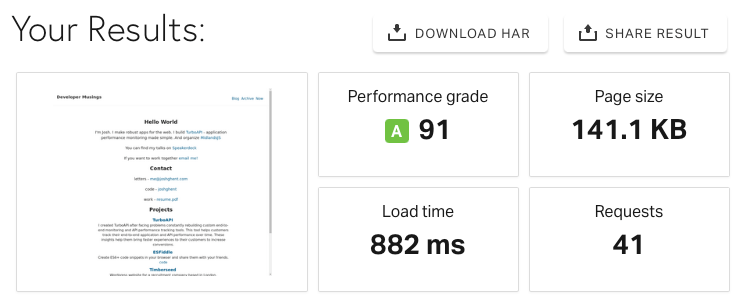

So, things look a little different around here. I took the time to overhaul the previous design of my site into something more simple. But why? This post is meta but bear with me.

The three reasons are as follows:
* Accessibility
* Performance
* Privacy

## Accessibility
After hearing a talk by [Jadene Aderonmu](https://twitter.com/hellojadene) about the [WCAG guidelines](https://www.w3.org/WAI/standards-guidelines/wcag/), I began to include accessibility as a critical part of a website. Often, I had pushed accessibility to the side. Because it was difficult to test and seldom noticed.
But accessibility is vital. Recently, an "Ask Hacker News" post asked, ["How do I prepare as a developer going blind?"](https://news.ycombinator.com/item?id=22918980). Although a small part, I realised how little notice of a large community I took. My website is only a drop in the digital sea. But, as with the [boy and the starfish](https://www.peoplehr.com/blog/2015/11/20/the-story-of-the-boy-and-the-starfish/) "I made a difference for that one". I don't have the power to change the web, but I do for my tiny corner of it.

I found my accessibility had many glaring errors - one being the colours I used. The orange ([#ff6c2f](https://www.color-hex.com/color/ff6c2f)), used for links and other highlights, didn't meet the contrast guidelines of the WCAG. And, the dark theme didn't meet the mark either. I ripped these out in favour of a simple blue and white theme.

The markup of the site was also lacking. Under the hood, my navigation bar wasn't getting identified as a navigation bar by the browser. I cleaned this up and now have made the site navigational via a keyboard.

I plan to improve my sites accessibility further by scanning all articles for basic metadata like `alt` tags.

	
  <em>The results so far! No violations - up from a score of 80%!</em>

## Performance
My blog had become bloated - over 300KB. For most modern websites being well over 1MB, 300KB seems like a small fry. Who cares right? I took a step back and analysed what this site was - a collection of static HTML pages. On that basis alone, the homepage should not be 300KB - it's text on a page.

I started trimming the fat.

First, I pruned Google analytics and Disqus (which I'll talk about later). Next, Google Fonts and Twitter embed went. Finally, I redesigned the site to remove the dark mode toggle, unused CSS and images. This produced a simple design that focused on the reading experience only.

After all this pruning, I was down to 140KB. There is still room for improvement I am sure.

	
  <em>Screenshot of Solarwinds tools, showing the page weight reduced from 300KB to 140KB</em>

## Privacy
The genesis of this redesign was simple. I had decided I wasn't getting benefit out of Google Analytics and Disqus. And, the readers of this blog had their privacy invaded. I decided to remove this, so now my blog is 100% my content.

For comments, readers can now contact me via email. And, analytics I've let go of all together. Ultimately, I'm writing this blog for me. I'd love if someone else got benefit out of this, but if they don't then that's ok too. I've let go of the idea of being some famous super blogger - it wasn't a conscience hope but something in the back of my mind. I'm not interested in optimising my content for clicks or ads. I'm interested in improving my writing craft, whilst building a personal knowledge bank for myself.

## Upcoming
This simple design comes along with a principle that I'm now practising in my life - simplicity. I've realised I want to embrace the things I value and discard those that don't. I'm speaking not just of possessions here, but words, apps, health and more. I wouldn't describe myself as a minimalist - but it's along a similar vein. Soon, I'll be speaking more about this practise of "simplicity" and how it relates to me as a software engineer.
