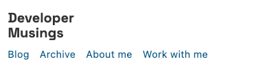

I was fed up. I was writing a post for my site the other day and was reminded of the fact that I couldn't run the site locally. It was time to fix that, once and for all. I was going to take on the task of lifting my site from the stringed together mess and add some new features along the way.

Here's how I did it:

## Gatsby V4

First thing on the agenda was upgrading Gatsby. The existing site was on Gatsby V2 and now didn't even run on my computer. As I was upgrading 2 major versions, and dozens of other plugins, I thought I was in for a difficult time. But, thankfully the upgrade process was relatively painless.

I simply run `ncu -u && yarn` and I was away!

I did have to update the `gatsby-plugin-feed` as it now required configuration. I popped in the following, based on the example in the documentation and hey presto!

```js
{
      resolve: `gatsby-plugin-feed`,
      options: {
        query: `
          {
            site {
              siteMetadata {
                title
                description
                siteUrl
                site_url: siteUrl
              }
            }
          }
        `,
        feeds: [
          {
            serialize: ({ query: { site, allMarkdownRemark } }) => {
              return allMarkdownRemark.nodes.map((node) => {
                return Object.assign({}, node.frontmatter, {
                  description: node.excerpt,
                  date: node.frontmatter.date,
                  url: site.siteMetadata.siteUrl + node.fields.slug,
                  guid: site.siteMetadata.siteUrl + node.fields.slug,
                  custom_elements: [{ "content:encoded": node.html }],
                });
              });
            },
            query: `
              {
                allMarkdownRemark(
                  sort: { order: DESC, fields: [frontmatter___date] },
                ) {
                  nodes {
                    excerpt
                    html
                    fields {
                      slug
                    }
                    frontmatter {
                      title
                      date
                    }
                  }
                }
              }
            `,
            output: "/rss.xml",
            title: "Developer Musings - Josh Ghent RSS Feed",
          },
        ],
      },
    }
```


## Fixing the archive page

This is something that has bugged me for ages. For the eagle-eyed among you, you may have noticed all the way at the bottom of the page that February 2018 was listed before December and November 2018.

Initially I thought this was to do with my custom graphql grouping that groups based on the `year-month`. But after some debugging I found that it was grouping correctly, but not sorting the groups.

I added a sort to the `allMarkdownRemark` graphql statement but that had no effect.

Then I noticed that all of the months were just single digits. So to graphql, "2018-10" was greater than "2018-2".

I updated my code that added this node to this:

```js
// gatsby-config.js

function pad(n) {
  return n < 10 ? "0" + n : n;
}

exports.onCreateNode = ({ node, actions, getNode }) => {
  const { createNodeField } = actions;

  if (node.internal.type === "MarkdownRemark") {
    const value = createFilePath({ node, getNode });
    createNodeField({
      name: "slug",
      node,
      value,
    });

    const date = new Date(node.frontmatter.date);

    const year = date.getFullYear();
    const month = pad(date.getMonth() + 1);
    const yearMonth = `${year}-${month}`;
    const day = date.getDate();

    createNodeField({ node, name: "year", value: year });
    createNodeField({ node, name: "month", value: month });
    createNodeField({ node, name: "year-month", value: yearMonth });
    createNodeField({ node, name: "day", value: day });
  }
};
```


After restarting the site build, the dates were all prefixed with zero's and the sorting worked!

Unfortunately, when I created a pull request for a site, and Netlify attempted to create a deployment preview, it failed. After reviewing the issue, it was due to a plugin `Gatsby-plugin-preact`. This plugin massively reduced the bundlesize of my site. But, I couldn't find a way of working around the problem so I had to remove it. It appears to be a problem associated with the fact that Preact and React are now no longer interchangeable as of V18+. Unfortunately, this means my sites payload is up to 400Kb. I'll be working to reduce this as that's far too bloated.


## Design

Design has never been something that came naturally to me. But, I employed a trick from some great artists - I copied.

For example, the little block page breaks, they are from [Mu-An Chiou](https://muan.co/). I loved the clean, minimal design of her site. Mine looked a little rough around the edges and needed *something* to make it a bit different. I'll be continuing to iterate upon the design.

I also fixed a long standing issue with the mobile navigation. The buttons were so close to each other you couldn't really click on the link you wanted. Or at least I couldn't with my fat fingers.

<div class="image">
  
</div>

<div class="image">
  
</div>

So I updated the links to give them more space.


The last thing was fonts. Websites should be interesting to look at. And, in a small part, I tried to accomplish that by using a new title font - [Space Grotesk](https://fonts.google.com/specimen/Space+Grotesk).

I feel this font face immediately tells you its a blog about software development. I'm going to work on other small design tweaks to make the site more charming.


## Webmentions

Something that's been on my list for ages is adding indieweb features, like webmentions. A number of my friends, Carol, Jamie and others, have added webmentions to their sites.

The basic premise is that you can collect instances where you site has been referenced around the entire web. It sort of goes back to what the web was originally intended to be, a network of pages.

In the past, I had a comments section on Discus. It was removed shortly after due to lack of usage. No one leaves comments on sites anymore. But they do tweet about it or add it to their newsletter. And webmentions allows us to collect those instances. You can give it a try by tweeting a link to this post and seeing your tweet appear at the bottom of this page!

The webmentions are fed from https://webmention.io. A fantastic free API that collects all of these mentions for your site.


## H-Feed

A small Indieweb update I made was to include a H-Feed for my blog posts. Think of H-Feeds as RSS for the Indieweb.

I added the following code to my `/archive` page.

```js
<ul style={{ display: 'none' }} className="h-feed">
    <h1 className="p-name site-title">{siteTitle}</h1>
    <p className="p-summary">Archive of all posts from joshghent.com</p>
    {data.posts.edges.map(({ node }) => (
        <li>
          <article className="h-entry">
            <Link className="u-url" href={node.fields.slug}>
              <h2 className="p-name">{node.frontmatter.title}</h2>
            </Link>
            <address className="p-author author h-card vcard">
              <a href="https://joshghent.com" className="u-url url p-name fn" rel="author">Josh Ghent</a>
            </address>
            <span>
              <time className="dt-published" dateTime={node.frontmatter.date}>
                {node.frontmatter.date}
              </time>
            </span>
            <p className="p-summary">{node.frontmatter.description}</p>
          </article>
        </li>
      ))}
  </ul>
```


## Tests

Ok so this bit might be a bit overkill. I added tests to my website.

My motivation was simple:

- Wanted to reliably merge dependabot (and my own) updates without issue
- I wanted to learn more about site testing (where there isn't code per-se to be unit tested)

I added a few tests using Jest that make sure certain components render correctly when given certain inputs. I utilized snapshots which have worked great so far and even caught some bugs!

In the future, I'll be adding screenshot testing to make sure the webmentions component renders correctly and more.


## What's Next?

My next phase of development for my site is adding new data sources and capturing "notes". Many Indieweb people prefer to use apps that publish to a micropub endpoint. But I don't want to do anything "special" outside of my normal workflow (like tweeting, listening to music etc). So instead, I've decided to attempt to do it all via Github Actions.

I already [have the first action setup](https://github.com/joshghent/blog/blob/master/.github/workflows/bookmark.yml) that will record data associated with a page that I bookmark. It was created by [Katy DeCorah](https://katydecorah.com), with the idea that each time you want to bookmark a page, you can do so by creating a github issue. The action then reads the URL and records it to a yaml file.

The last part, which I haven't done, is using that data to dynamically create pages.

But, onwards and upwards!