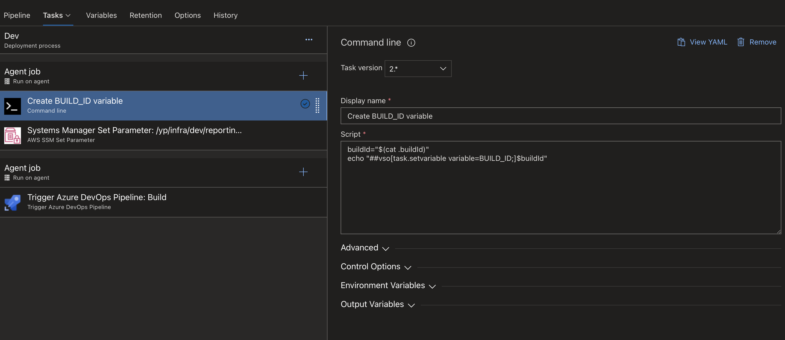

Continuous delivery is something that we're all striving for. I was doing the same, but there was a snag:

- My terraform code and API code were in separate projects
- I wanted to make updates to the API code and have it build and update the ECS service
- I didn't want to manage the container definition separately as it had too many dependant resources (Datadog sidecar etc.)
- You have multiple environments and don't want to have to use a separate git branch for the API code.
- You have a branch for each environment for your infrastructure that is independently deployed.

Maybe you have this problem too. Because Terraform uses a specific ECR image path to build the container definition, how do we ever update it automatically?

There are several ways to solve this problem, many of which are discussed in [this thread](https://github.com/hashicorp/terraform-provider-aws/issues/632). But, today, I'm going to show you how I resolved this issue.

1. Setup your Docker build/deploy pipeline

First things first, we need the API Docker image inside ECR. This will vary according to what CI system you use - in our case we use Azure DevOps.

When the image is being built, we want to tag it uniquely. Ideally, you want something numerable. In our case, we chose to use Azure's built in "BuildId" parameter to tag the images.

Below you can see the build steps we take in the CI pipeline. After the image is built, it creates a text file with the BuildId in it and ships that as an "Artifact". This will become important later. But the main thing is you need to trigger a further pipeline for your environments based on that parameter changing.

```yml
- task: Docker@2
  inputs:
    command: build
    DockerFile: "$(Build.SourcesDirectory)/Dockerfile"
    repository: ${{parameters.projectName}}
    tags: |
      $(Build.BuildId)

- task: ECRPushImage@1
  inputs:
    imageSource: "imagename"
    sourceImageName: ${{parameters.projectName}}
    sourceImageTag: "$(Build.BuildId)"
    repositoryName: ${{parameters.projectName}}
    pushTag: "$(Build.BuildId)"

- task: Bash@3
  displayName: "Upload Build Artifact of the Docker image Id"
  inputs:
    targetType: "inline"
    script: |
      # Add the build Id to a new file that will then be published as an artifact
      echo $(Build.BuildId) > .buildId
      cat .buildId

- task: CopyFiles@2
  displayName: "Copy BuildId file"
  inputs:
    Contents: ".buildId"
    TargetFolder: "$(Build.ArtifactStagingDirectory)"

- task: PublishBuildArtifacts@1
  displayName: "Publish Artifact"
  inputs:
    pathToPublish: $(Build.ArtifactStagingDirectory)
```

Make sure to run this pipeline now you've created it.

2. Setup an SSM (Systems Manager) parameter

SSM is an AWS service I had previously never really used. Its parameter store feature will allow us to store a variable that we can update later - in this case, the docker image tag.

Create a new parameter by going to AWS Systems Manager > Application Management > Parameter Store. Name the parameter something like `/my-api/${env}/docker-image-tag` (where `env` is the environment, you'll need to duplicate this parameter for all the environments you have). It should be a "String" variable and be the unique tag that is generated by your CI build pipeline - in my case, the BuildId.

3. Create your deployment pipeline

Now, we need to define a way to update the image just in a certain environment (e.g., just `development`). How can we do that?
Because of our setup, the duplication effort is fairly minimal. We already have our image build (which is consistent across all environments). We just need to update that SSM parameter to use the unique tag (BuildId) that the build pipeline generated.

In Azure, you can trigger a pipeline based on an artifact as we generated in step 1. I then configured 3 tasks based on this:

- Get the BuildId from the file and add it to the runners environment
- Update the SSM parameter for that environment to the new BuildID
- Trigger the Infrastructure/Terraform pipeline for that environment - this is where the new SSM parameter value will get picked up and used in a container definition.

<div class="image">
	
</div>

4. Update Terraform to use the SSM parameter

Now you've got the SSM parameter being updated each time there is a new build, we need to set up Terraform to use the SSM parameter as part of the image name.

```hcl

// Import the SSM parameter
// This can be done on a module level because it depends on the environment
data "aws_ssm_parameter" "docker_image_id" {
  name = "/my-api/${var.environment}/docker-image-tag"
}

// Use it later on...
container_image = "<AWS_ACCOUNT_ID>.dkr.ecr.<REGION>.amazonaws.com/my-api:${data.aws_ssm_parameter.docker_image_id.value}"
```

5. All done!

Now you've set up a complete continuous deployment pipeline with Terraform and ECS. To review, here's how the system works

1. Creates and builds a new ECR image tagged in a unique way
2. The build pipeline notifies the release pipeline of this new image tag in some way (in Azure's case, a build artifact)
3. The release pipeline updates the SSM parameter based on the image tag and triggers the Terraform deployment pipeline for that environment.
4. Terraform picks up the new SSM value and implements it

There are two obvious downsides to this approach:

1. Multiple updates to multiple API's could cause locking issues where you have to manually run the Terraform pipeline once.
2. It's a bit slower than other approaches, but the best one I could find. Plus if your Terraform repo deploys in less than 2 minutes like ours, then it's not a big problem.
