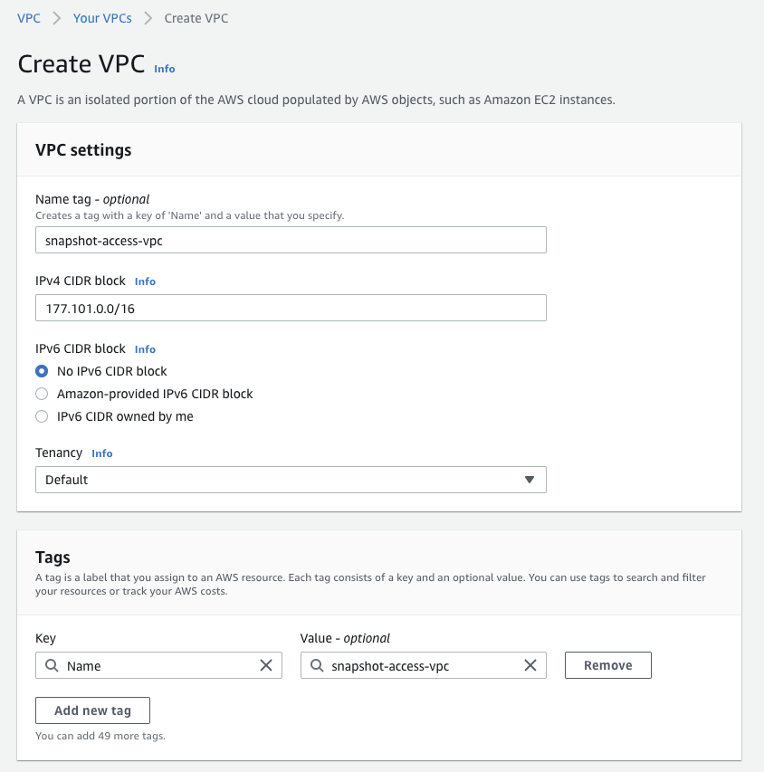
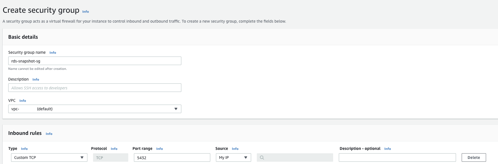
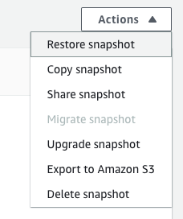
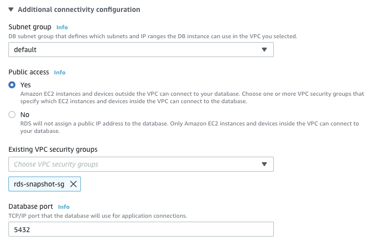

Recently, I had a case where I needed to gain access to an RDS Instance that I had long since deleted. To add insult to injury, the Bastion host to gain access to the Database server had also been deleted and it's VPC, Security Groups and all the other architecture components! Yikes.

Fortunately, I had taken a final snapshot before it was deleted. Phew!

I thought it was as simple as downloading the snapshot, which I assumed was just an SQL Dump, import it into a local Database and then bobs your uncle. Not so fast... RDS Snapshots aren't just database dumps, after all that would just be too easy! Instead they are bespoke AWS format that is not able to be parsed and imported with a tool.

Despite there being documentation, it's fairly lacking so I thought I'd write a guide on how I gained access to the data within an RDS snapshot.

## 1. Create a new VPC

The first step is to create a new VPC. Name it what you like and give it any old CIDR Block. Leave everything else standard

  

## 2. Create a Security Group for the VPC

Next, you need to create a security group for the VPC you just created.
Simple add a name, then select your previously created VPC you created in step 1.

Next in the Inbound Rules pane, create an new inbound rule to allow traffic on Port 5432 (the PostgreSQL default port). The source should listed as "Your IP", which will prefill it on the current IP address you are accessing the AWS Console on.

  

## 3. Restore the RDS Instance

Now you've done that, go to RDS and then Snapshots.
Find the snapshot you're looking to get data from and click "Restore snapshot"

This will send you to a configuration page for the instance you are about to boot.
First, change the instance type to something cheaper because the default is something more powerful than Deep blue and costs about as much as a mission to the moon.

Afterwards, change the VPC that the instance is in, to the one created earlier and change the security group to the one created earlier. In my case "snapshot-access-vpc" and "rds-snapshot-sg". Additionally, select "Public Access".

  

Now hit Create and your instance will launch with the snapshot data.

## Hey Presto!

You should not be able now connect to your RDS instance using the details on the Connectivity Pane when clicking on your RDS instance in the list. Hopefully you found this helpful!

Make sure to tear down this access after you finish using it as it is by no means secure. It should purely be used for grabbing data retrospectively if a client requests it.
