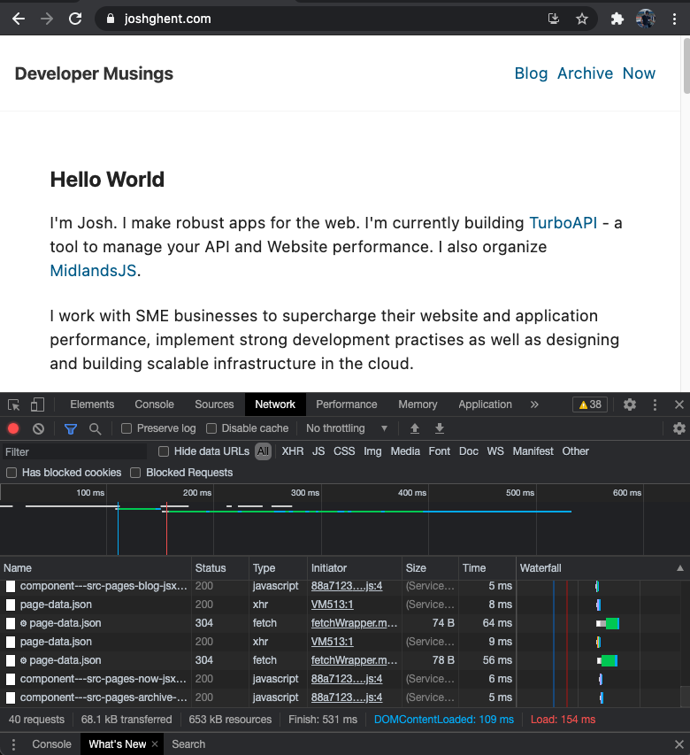

Web performance is vital part of your business to ensure customers keep returning. [One retailer found that by reducing their page load by 65%, they saw a 63% increase in organic traffic](https://wpostats.com/2019/01/08/carousell-traffic-ctr.html). Google is also beginning to use the ["core web vitals"](https://web.dev/defining-core-web-vitals-thresholds/) to rank your page in search results. Despite this, it can be difficult to get the time for it. So often, teams will de-prioritize performance fo the sake of more features.

Although there are specific ways on how to improve site performance based on your technology stack, server, customer requirements and more, here's a guide on how to improve your websites performance if you're on a deadline - regardless of those factors. Got no time to read the article? Simply read the headings for each section.

## 1. Gzip and Brotli

Gzip and Brotli are two compression algorithms, they are used to compress resources on your server before sending them to the customers browser. This makes the file smaller, thereby making it quicker to transfer. The browser then unzips these files and then uses them. All the major browsers have support for at least 1 of these compression types.
This is such an easy change that gives such a large impact. A report by Akamai in 2016, reported a file size reduction of 63% by Gzip for JS files and 68% by Brotli.

Here's links to a few guides on how to do it for your setup

- [AWS S3 + Cloudfront](https://docs.aws.amazon.com/AmazonCloudFront/latest/DeveloperGuide/ServingCompressedFiles.html)
- [IIS](https://docs.microsoft.com/en-us/iis/extensions/iis-compression/iis-compression-overview)
- [Nginx](https://computingforgeeks.com/how-to-enable-gzip-brotli-compression-for-nginx-on-linux/)
- [Apache](https://bash-prompt.net/guides/apache-brotoli/)

## 2. Cache control on all resources / Use Cloudflare

Caching can hugely speed up subsequent page loads by storing resources on the customers computer. This means you only need to deliver any dynamic content such as API responses and so on. Add a long cache control so that resources are cached for a month or more. Will this cause bugs? No! If you use a build tool like webpack, it will create new file names that will force the browser to re-download the page when you do a new release.
This very blog is cached heavily, so try this to see the impact of caching on page speed.

1. Open up chrome dev tools (F12)
2. Go to the Network Tab
3. Notice the red "Load" time.
4. Now click and hold on the Refresh button - a dropdown menu will appear. Click, "Empty Cache and Hard Reload"
5. Check the "Load" time - when I did this test it was 482ms.
6. Click the Refresh button normally
7. Check the time again - now it's only 154ms! A 68% percent improvement!

<div class="image">
  
</div>

Here's some links on how to do it.

- [AWS S3 + Cloudfront](https://docs.aws.amazon.com/AmazonCloudFront/latest/DeveloperGuide/Expiration.html) - Scroll to the bottom
- [IIS](https://docs.microsoft.com/en-us/iis/configuration/system.webserver/caching/)
- [Nginx](https://www.nginx.com/blog/nginx-caching-guide/)
- [Apache](https://www.digitalocean.com/community/tutorials/how-to-configure-content-caching-using-apache-modules-on-a-vps)

## 3. Implement a build process for front-end resources (JS and CSS)

If you haven't already, try to implement a build process for your Javascript and CSS files. Why? Because using a build process can make the files smaller and compatible with the browsers you need to support. If you have tested your site on [Google's Page Speed Insights](https://developers.google.com/speed/pagespeed/insights/) and have seen the dreaded "Remove unused Javascript" then this step is for you. A build process will significantly reduce your initial bundle size thereby reducing load times.

Here are a few links on how to do this. Webpack is a little complex to setup, but is worth the effort in the long run. You can also expand it's usage to optimize images and other funky things.

- [https://www.blog.duomly.com/what-is-webpack-and-how-to-setup-webpack/](https://www.blog.duomly.com/what-is-webpack-and-how-to-setup-webpack/)
- [https://torquemag.io/2019/06/optimize-javascript-css/](https://torquemag.io/2019/06/optimize-javascript-css/)

## 4. Defer and Asynchronously load 3rd party resources

"You've got a massive head" - that's what I say when I visit most websites. But seriously, they have a huge amount of resources in their `<head>` tag! Why is this a problem? Because resources, such as JS and CSS, are loaded at the top of the page, this is the first thing the browser loads. Thereby blocking it from loading any of the content further down! You might say you _need_ to load Google Analytics, Intercom and a myriad of other trackers right away, but the answer is simply that you don't. By deferring and loading resources asynchronously, you will drastically improve load times for your customers and the resources will still be loaded quickly anyway.

How can you do this? I'll share this directly because it's a simple change.

```html
<!-- This -->

<link
  href="https://fonts.googleapis.com/css2?family=Ubuntu:wght@400;700&display=swap"
  rel="stylesheet"
/>
<script src="https://mysite.com/script.js"></script>

<!-- Becomes This -->

<link
  href="https://fonts.googleapis.com/css2?family=Ubuntu:wght@400;700&display=swap"
  rel="stylesheet"
  media="print"
  onload="this.onload=null;this.removeAttribute('media');"
/>

<script defer async src="https://mysite.com/script.js"></script>
```

Now you can move these tags to before the closing `</body>` tag at the bottom of the page. Job done! You should see a huge improvement in your [First Contentful Paint](https://web.dev/fcp/) Times.

## 5. Load polyfills only when needed

Polyfills are small snippets of code that allow developers to use modern Javascript features on older browsers. But the problem is, how do you load polyfills only for customers who need it? Otherwise, you will compromise the modern browser experience which likely makes up the majority of your customer base. Here is a great write up by Phillip Walton on this very topic - [https://philipwalton.com/articles/loading-polyfills-only-when-needed/](https://philipwalton.com/articles/loading-polyfills-only-when-needed/)

## Bonus 6. Set Performance budgets

Bonus round now. Hopefully, you've made some performance improvements and you can see a difference in page load times and your Lighthouse score. But so often, without monitoring something, it's likely to drift. For example, if you are putting up shelves in your house, you need to constantly keep an eye on the level using a spirit level. You cannot just put it there once and then eyeball it the rest of the way. In the same way, you need to monitor your key performance metrics in order to make sure they don't return to how they were.

You can do this with tools like [bundlesize](https://github.com/siddharthkp/bundlesize), [webpack dashboard](https://www.npmjs.com/package/webpack-dashboard), [speedcurve](https://speedcurve.com) and more.

So, now you can monitor the performance you need to set a budget. In other words, what is the limit of performance the business can take (e.g., what is the slowest average load time we can take without affecting revenue). I will write an article on this in the future, but I'd recommend taking the worst result of each metric in the past week and set that as the budget. This can then be in-forced by tools such as [LighthouseCI](https://github.com/GoogleChrome/lighthouse-ci).

## Takeaways

Overall, I hope you've learnt some quick ways to improve your web performance. As mentioned, there are a myriad of factors to consider when looking to improve web performance so the methods above will not be a one-size fits all. If you'd like to know why your site is slow, I can help you. I'm a software performance consultant who works with organizations of all sizes to analyse and fix site speed issues. If you'd like to work together, email me on [me@joshghent.com](mailto:me@joshghent.com)
