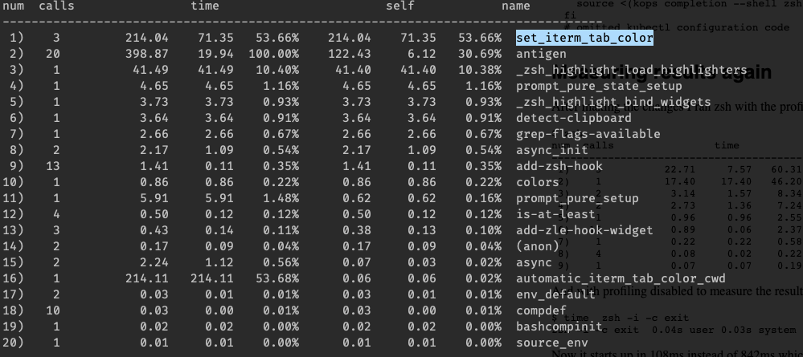

As part of my work to "sharpen the saw", I decided to spend some time improving the performance of various components in my setup. The first target of my attention was ZSH.

## Why?
I open new shell instances constantly and try to live in the terminal as much as possible (including for writing this blog - in vim to be precise :wave:), so each second spend loading new shell windows or tabs is a second wasted. Additionally, when things take time to load, you're more distracted and/or frustrated with how long it's taking to load rather than the current outcome you were trying to achieve. In my eyes, speed is one of the 3 major pillars of user experience - along with findability and accessibility.
To start on this performance journey, I first needed a quantifiable metric to track my progress as I made changes.

To do this I ran the following command
```bash
for i in $(seq 1 10); do /usr/bin/time $SHELL -i -c exit; done
```

Try running it in your shell of choice now, and you'll get a performance breakdown of 10 runs of initiating your shell! For me the response was this
```
1.5 seconds 0.8 user 0.7 sys
```

1.5 seconds may not seem like a lot, but that is more than noticable to any human. Time perception is a whole other topic for far more intelligent people than I. But after some digging, the consensus seems to be that reaction times are around 150ms (input-to-action) and 13ms for perseptive time (from visual stimuli).
Therefore, our benchmark we were aiming for was 0.13 seconds. This is a number I now seek out across all software I use and consume.

Ok so, we've got a benchmark of 0.13 seconds meaning we need to reduce the load times by 1.37 seconds - let's get to it!

## Phase one - the big boys
I had a rough idea of what might be taking the time in my zshrc file.
1. NVM - this is a node version library that I've (unfortunately) used for years. It allows you to quickly swap between node versions. Handy but performance intensive. It initiates for each shell instance so you have access to the `nvm` command. I don't need this all the time, so it can be removed. Note, by removing this, it still allows me to use the "NVM" node install - just not change it.
2. ZSH Sourcing - The standard oh-my-zsh config contains the line `source $ZSH/oh-my-zsh.sh`. We don't need this as I was using Antigen as a plugin manager, which automatically includes oh-my-zsh, so in reality I was sourcing it twice!

After these changes, I ran the test script from earlier and got the following result
```
0.61 real 0.32 user 0.27 sys
```

That's nearly a second removed just by removing NVM and sourcing ZSH! A huge difference so happy about that.

The next suspect I had on my list was my prompt, I used this heavy emojified Spaceship theme that was installed via NPM. Most of the time, if something looks good, it takes ages to load.
I switched over to the [Pure prompt](https://github.com/sindresorhus/pure) and remeasured the results
```
0.54 real 0.29 user 0.24 sys
```

Ok, so not a massive change, but the overall experience of loading a new shell felt instantly snappier. It could have been a placebo but it worked for me, so I plowed on ahead for more culprits. But I needed help...

## Phase two - profiling
Now I had removed some "big hitters" to performance, it was time to dive into the nitty gritty. We can do this by profiling our ZSH config so we can see what is taking the time.
We can do this with a tool called [zprof](http://zsh.sourceforge.net/Doc/Release/Zsh-Modules.html), which is bundled with ZSH by default.
We can add it by putting `zmodload zsh/zprof` at the top of our `~/.zshrc` config and then putting `zprof` at the very bottom of the config.

Now we simply need to reload our shell and we get a nice breakdown of the time taken for each part of our config.



We can clearly see from the above screenshot that a plugin called set_iterm_tab_color is accounting for a lot of our load time. The plugin wasn't really what I wanted it for anyway (I wanted something like peacock for VSCode).
I removed it and a few other Antigen plugins and re-ran the test script again
```
0.30 real 0.17 user 0.14 sys
```

That's the load time halved! I was pretty happy to stop at this stage but I kept pursuing that prized 0.13 seconds.

## Phase Three - Antigen to Antibody
Here's where things went wrong. As you could see from the screenshot, my second biggest load time item was Antigen itself. Antigen is known as a bit of a [big beast](https://github.com/zsh-users/antigen/issues/116). So I started to look for alternatives.
Antibody was advertised as a answer to Antigen's woeful performance. I spent around 2 hours diligently porting my config over to Antibody.
However, when I *eventually* got it working and battled through the lackluster documentation, I found it was actually slower than Antigen! A bit annoying to say the least. I didn't write down the test results from then but they were somewhere in the region of 0.8 seconds.

## Phrase Four - Remove Pyenv
The last phase I did for now was to remove pyenv and compinit. Loading of pyenv is something that had escaped my notice when originally pruning through my config. I barely do any python development nowadays so this got removed hastily.
I reran the tests and...

```
0.19 real 0.10 user 0.08 sys
```

Ok, so it's not quite the 0.13 seconds I had hoped for, but not bad.

By this stage, the main load times for opening new tabs was iTerm2 itself (my terminal application of choice). Going forward I am going to switch over to Linux and most likely use Kitty which is a blazing fast terminal program. This should null and void any performance gains I'd get by reducing it down by that 0.05 seconds.

## Conclusion
This was a really good use of a few hours of time. It's going to make me happier and more productive at work, which in my mind, is time well spent. I still have plans to speed up ZSH (asides from Kitty) but they will have to wait (convert over to Zplugin and reduce plugins even more).
For now, I'll move onto other programs I use regularly like VSCode and Chrome for more performance gains there.

I hope this post helps you speed up your ZSH - let me know the speeds you get on twitter - @joshghent

Speaking of performance, I'm currently working on a side project called TurboAPI. It's a super simple tool designed to monitor your API and Webhook's performance without installing a thing. I'd love if you could check it out [here](https://turboapi.dev)
